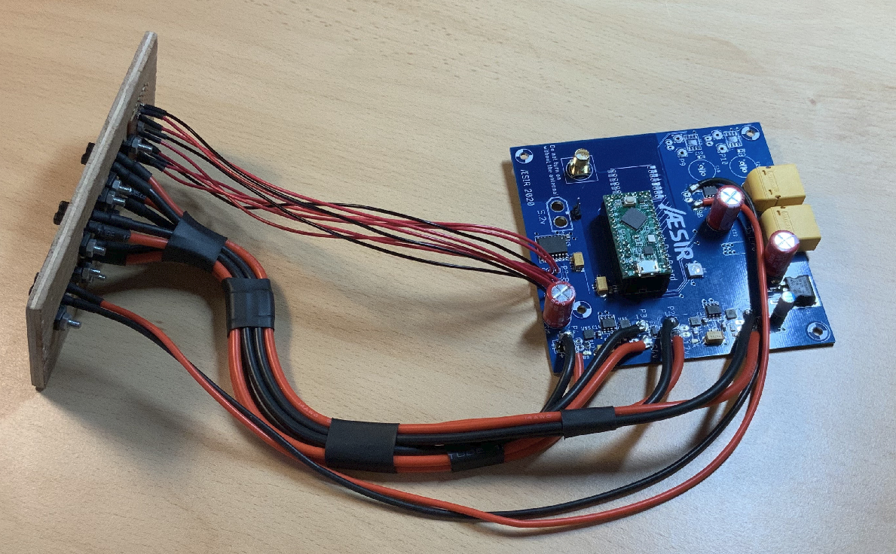

# Launchpad Controller <!-- omit in toc -->

This is the embedded software on the Launchpad Controller to be used for the Mjollnir project.
It controls all the equipement on the Launchpad and is remotely operated from the Ground Station

The Launchpad Controller is an upgraded version of what was used for the Sigmundr (2019) and Odin (2018) projects. Check the previous versions here:

- [v1.0](https://github.com/aesirkth/launchpad-controller/tree/v1.0) - Odin
- [v2.0](https://github.com/aesirkth/launchpad-controller/tree/v2.0) - Sigmundr

*The work on the Mjollnir project is still ongoing*



# Contents <!-- omit in toc -->

- [Description](#description)
- [Installation](#installation)
- [Commands](#commands)
- [Folder structure](#folder-structure)

# Description

The Launchpad Controller runs on a Teensy LC microcontroller from [PJRC](https://www.pjrc.com/teensy/teensyLC.html) and the code is built around the cross-platform development tool [PlatformIO](https://platformio.org/)

The following outputs are available on the board:

- 2x 12V/15A DC
- 2x 24V/15A DC
- 3x 6V servo-compatible outputs
- 3x 12V-24V/2A H-bridge (output voltage selectable by jumper)

More details about the hardware in [doc/hardware.md](doc/hardware.md)

There are two ways to connect the Launchpad Controller to a computer:
- Through the USB port on the Teensy LC. It appears as a Serial device. This is the preferred way for testing purposes
- Through a LoRa link. In this case, a second Launchpad Controller (or any equivalent board) is needed. It appears as a Serial device. The Launchpad Controller on the computer side acts as a gateway and forwards all commands received on its Serial interface to the actual Launchpad Controller via LoRa

The Serial baudrate is set in `platformio.ini` but is not actually used with Teensy microcontrollers. Keep it here to use other microcontrollers with no modifications

# Installation

Install PlatformIO Core on your system. The documentation is [here](https://platformio.org/install/cli)

Connect the board to your system using a micro USB cable

Build and upload the code to the Launchpad Controller using PlatformIO cli

```sh
platformio run -t upload -e controller
```

Currently, a second Launchpad Controller is needed on the Ground Station side to send the commands. Build the code and upload it

```sh
platformio run -t upload -e gateway
```

# Commands

See [doc/commands.md](doc/commands.md) for a complete list of the available commands

# Folder structure

```cpp
├── doc/
├── include/
│   └── hardware_definition.h   // Pinout and hardware constants
├── lib/
├── src/                        // Main code
│   ├── controller.cpp
│   ├── controller.h
│   ├── gateway.cpp
│   └── gateway.h
├── test/                       // Code for unit tests
│   ├── test_main.cpp
│   └── test_main.h
├── platformio.ini              // PlatformIO configuration file
└── README.md                   // This file
```